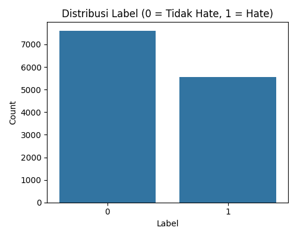
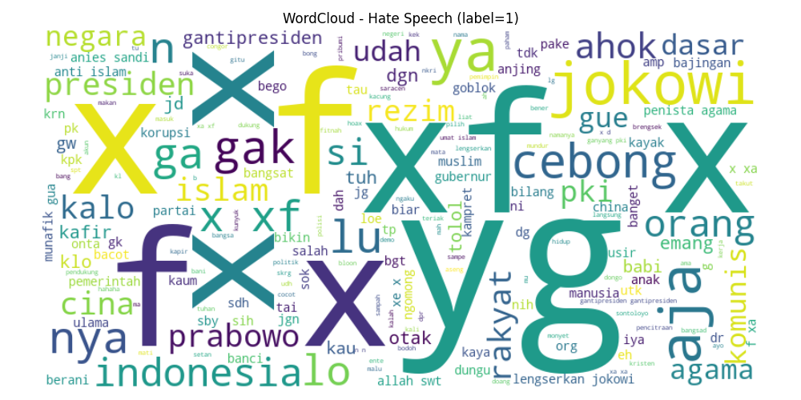
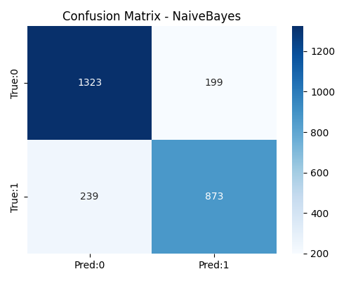
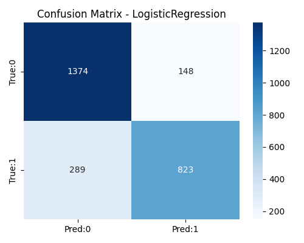

# Laporan Mini — Deteksi Ujaran Kebencian

**Dataset**: lokal (`re_dataset.csv`).

## 1. Latar Belakang

Singkat: tujuan membangun model untuk mendeteksi ujaran kebencian (hate speech) pada teks.

## 2. Metodologi

- Preprocessing: case folding, hapus URL/mention, hapus tanda baca & angka, tokenisasi dengan .split(), stopword removal (NLTK), stemming (opsional)
- Representasi fitur: TFIDF, max_features=5000
- Model: Naive Bayes, Logistic Regression, LinearSVC

## 3. Hasil & Analisis

### Distribusi label

### Word Cloud (Hate)

### Evaluasi model

#### Model: NaiveBayes

- Accuracy: 0.8337
- Precision: 0.8144
- Recall: 0.7851
- F1-score: 0.7995

Confusion matrix:

#### Model: LogisticRegression

- Accuracy: 0.8341
- Precision: 0.8476
- Recall: 0.7401
- F1-score: 0.7902

Confusion matrix:

#### Model: LinearSVC

- Accuracy: 0.8337
- Precision: 0.8222
- Recall: 0.7734
- F1-score: 0.7970

Confusion matrix:

## 4. Kesimpulan

Model baseline berhasil dilatih. Untuk peningkatan, pertimbangkan augmentasi data, embedding (IndoBERT), atau fine-tuning transformer.
